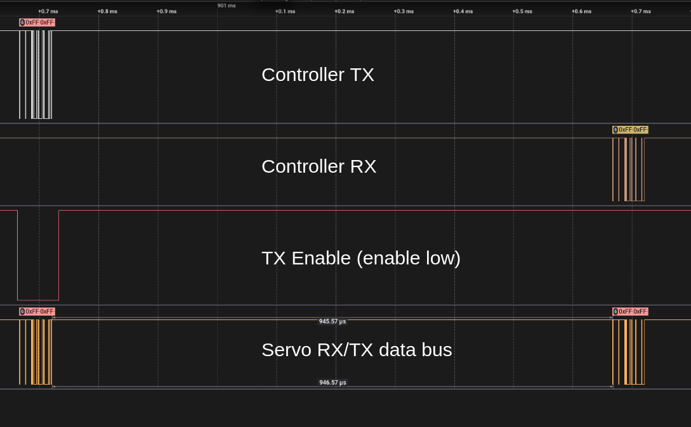

This library is originally based on https://github.com/vanadiumlabs/arbotix/tree/master/libraries/Bioloid.  
It retains the same underlying approach of emulating a half-duplex serial connection on an **Atmega644p** to control **Dynamixel 12A** servos, but is heavily refactored.

For information on the servos:
https://emanual.robotis.com/docs/en/dxl/ax/ax-12a/

## 'software' half-duplex
See branches:  
```sh
software_uart_to_half_duplex_atmega644
software_uart_to_half_duplex_atmega2560
```

The RX and TX lines must be connected in hardware.  
The library controls whether the bus is in RX or TX state by changing the serial port settings accordingly (see Atmega644p datasheet). Because the lines are tied together, the microcontroller may receive data that it sent out - this is filtered out by the library. 
The response should always be read after a transmission else there is a risk of putting the bus into transmit mode when the servo is also trying to send a response. For this reason I suggest that the status return level is kept on the default (ALL).

## Hardware half-duplex
See branch  
```sh
hardware_uart_to_half_duplex
```
  
  
  


## Communication protocol
Several different instructions. Below is shown how the packets in the example/instruction sketch look from a logic analyser on the rx/tx wire.
Full manufacturer's info here: https://emanual.robotis.com/docs/en/dxl/protocol1/

### Ping
Ping and response  
 
  
The response is received about 1ms after the request.
  

### Read register
Read register and response  
 


### Write register
  

### Staged write
  

### Trigger staged action
  

### Sync write
  
